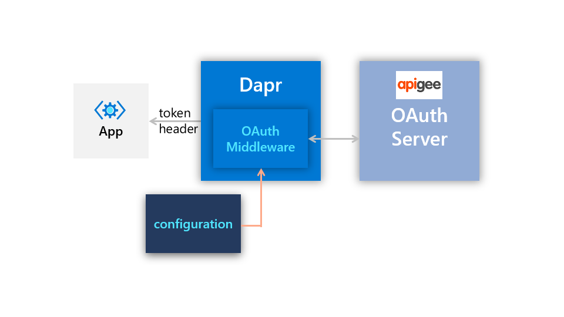

# Dapr Middleware Sample with Apigee Oauth2 Client Credentials Flow

This is a sample application that uses the Dapr middleware Oauth2 Component with the client credentials flow to access a protected resource sitting behind Apigee. The Dapr middleware component retrieves an access token from Apigee (acting as the Oauth2 server) and then this token is used in the application to access the protected resource on subsequent calls. Since HTTP middleware is used, no Oauth2 logic is needed within the application.



## Set up

1. Start by running through the setup for provisioning an Apigee instance, in the [Readme](./apigee/README.md). Note this sample is taken directly from Google's Client Credentials flow example [here](https://github.com/GoogleCloudPlatform/apigee-samples/tree/main/oauth-client-credentials).

1. Update the Dapr middleware component [oauth2-middleware](sample-app/components/oauth2-middleware.yaml) with your values from the Apigee deployment. Scope does not matter in this case.

1. Install Node dependencies and run the Dapr sample app locally as follows.

```bash
cd sample-app
npm install

dapr run --app-id echo-app  --dapr-http-port 3500 --app-port 3000 --resources-path ./components --config ./components/config.yaml --log-level debug  -- node echoapp.js
```

1. Test out the Oauth2 flow with the VS Code Rest Extension [test file](sample-app/test.http). The first two calls are direct to the application and will fail since there is no Oauth logic, whereas the second two use Dapr Service Invocation via HTTP to call the app and thus will have the Authentication header provided by the Dapr middleware component on inbound requests.

## Kubernetes Deployment

1. Run the makefile to build the docker container. If you want to use your own Docker registry you will have to update the [Makefile](sample-app/Makefile).

```bash
cd sample-app
make build
```

1. Deploy the Kubernetes and Dapr resources.

```bash
# Deploy Dapr components
kubectl apply -f ./components

# Deploy sample app
kubectl apply -f delpoy/echo-app.yaml 
```

1. Test the Kubernetes deployment by port-forwarding the echoapp pod and using the same [test file](sample-app/test.http). In a production-scenario, its recommended to add an ingress controller with Dapr-enabled to access these endpoints.

```bash
kubectl port-forward echoapp-<YOUR_POD> 3500:3500  
```
